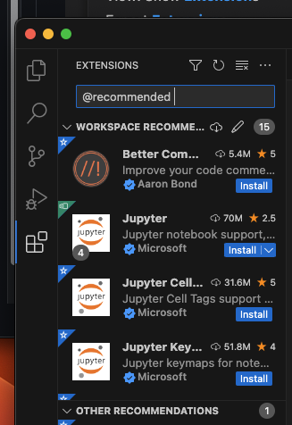

# 2. Visual Studio Code (aka vscode)

Other than vscode itself, we have installed Node.js and Git. Now we want to fine tune vscode to make it more suitable for Node.js development with Git. To be more precise, we are building a proper **workspace** for our need.

For moment, a workspace for us apply to a single project, which is a single repository (meaning a single folder). We will see later that a workspace can be a collection of folders.

## 2.1 Extensions   

First, configure recommended extensions.


Then, put the following to `.vscode/extensions.json`

```
    "recommendations": [
        "aaron-bond.better-comments",
        "formulahendry.code-runner",
        "codesandbox-io.codesandbox-projects",
        "dsznajder.es7-react-js-snippets",
        "dbaeumer.vscode-eslint",
        "github.copilot",
        "github.vscode-pull-request-github",
        "eamodio.gitlens",
        "riazxrazor.html-to-jsx",
        "ritwickdey.liveserver",
        "yzhang.markdown-all-in-one",
        "shd101wyy.markdown-preview-enhanced",
        "bierner.markdown-preview-github-styles",
        "davidanson.vscode-markdownlint",
        "vscodeshift.mui-snippets",
        "lostfields.nodejs-repl",
        "christian-kohler.npm-intellisense"
    ],
```

Show recommended extensions by typing `@recommended` in the search box.



Then click install one-by-one.

## 2.2 Run Code

You can run Node.js code directly in vscode following the instruction [here](https://code.visualstudio.com/docs/nodejs/nodejs-tutorial#_run-code).

  * Create `.js` file; or  
  * Type `node` in the integrated terminal to start a node.js REPL session (aka a console). You can leave the session by typing `.exit`.

> REPL session means Read-Eval-Print-Loop session. It is a simple interactive computer programming environment that takes single user inputs (i.e. single expressions), evaluates them, and returns the result to the user. A program written in a REPL environment is executed piecewise. 

