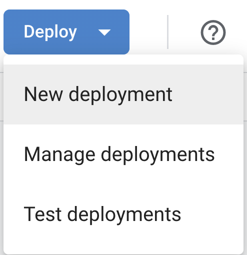
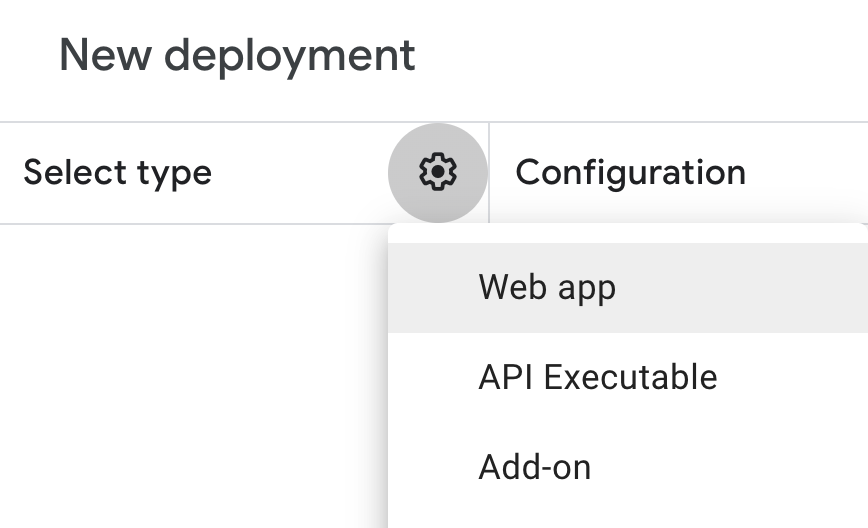
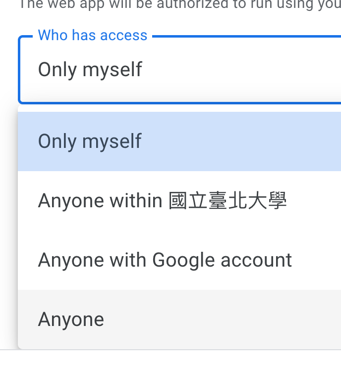

# Data 

## Google Sheet

  - <https://docs.google.com/spreadsheets/d/1u3Cv83PDD1CdbmYWM7ugLBs4Zyp7uz5MVg_ysH29Ouo/edit?usp=sharing>


To use the `doGet()` function in Google Apps Script to return the values of an active sheet, you can follow these steps:

1. Open your Google Apps Script project in the Apps Script editor.
2. In the editor, create a new function named `doGet()` without any parameters. This function will handle the HTTP GET request.
3. Inside the `doGet()` function, use the `SpreadsheetApp` service to get the active spreadsheet and the active sheet.
4. Retrieve the values from the active sheet using the `getDataRange()` method, which returns a range encompassing all the data in the sheet.
5. Convert the range values into a 2D array using the `getValues()` method.
6. Finally, return the values as a JSON response using the `ContentService` class.

Here's an example of how the code might look:

```javascript
function doGet() {
  var spreadsheet = SpreadsheetApp.getActiveSpreadsheet();
  var sheet = spreadsheet.getSheetByName("Sheet1");
  var dataRange = sheet.getDataRange();
  var values = dataRange.getValues();

  return ContentService
    .createTextOutput(JSON.stringify(values))
    .setMimeType(ContentService.MimeType.JSON);
}
```

After saving the script, you can deploy it as a web app by selecting "Deploy" from the menu, then choosing "New Deployment." Configure the deployment settings as needed, and click "Deploy." You will be provided with a URL that you can use to access the active sheet's values via an HTTP GET request.







## local data experiment

Before you include data fetch to your app, you should save a local copy as a .json file and develop your app with the local data. 

  - `data.json` is the local copy of the data.


## Fetch data

We will use `axios` module to fetch data from the internet.

Axios is a promise based HTTP client for the browser and node.js. We can use axios to fetch data from the internet.

First, we need to install axios.

```bash
npm install axios
```

Then, we can use axios to fetch data from the internet.

## Put Axios in the browser

`window.{object name}` will put the object in the browser (aka the global environment).

[axios in window](https://github.com/tpemartin/r-gallery2/blob/main/src/week12/App.jsx)

We can use:

```javascript
// type in your browser console with some url
const url = "https://script.google.com/macros/s/AKfycbzyPZ3PZyYF2cyh0qWBcjoGCrwoE99ePyUOfalnBsLnq2lz5YbNYvEGg8eZDP3CtUbBCw/exec"

axios.get(url)
```

  - to fetch data from the internet which uses the HTTP GET method. (Some APIs use POST method to fetch data from the internet.)


  - It takes a while to see the result.
  - The result is a promise object.

The promise object is a feature of javascript. It is used to handle asynchronous operations - operations that take a while to finish. When the operations finish, it can be resolved (successful) or rejected (failed). 

To do something when the promise is resolved, we can use `.then()` method. To do something when the promise is rejected, we can use `.catch()` method.

Inside `.then()` or `.catch()` is a function that takes the result of the promise as an argument.

```javascript

axios.get(url)
  .then((result) => {
    console.log(result);
  })
  .catch((error) => {
    console.log(error);
  });
```

will print either the successful result or the error message in the console. 


> Asynchronous operations will not block the execution of the program. The program will continue to execute the next line of code. When the asynchronous operation is finished, the callback function (the function inside `then` or `catch`) will be called.

## Async function

Use `.then()` and `.catch()` to handle the result of the promise is not very convenient. We can use `async` function together with `await` to handle the result of the promise.


```javascript
export async function fetchData() {
  try {
    const response = await axios.get(dataUrl);
    return create_dataObjects_from_data(response.data);
  } catch (error) {
    console.log(error);
  }
}
```
    
      - `async` function will return a promise object.
      - `await` will wait for the promise to be resolved or rejected. 
      - `await` can only be used inside `async` function.