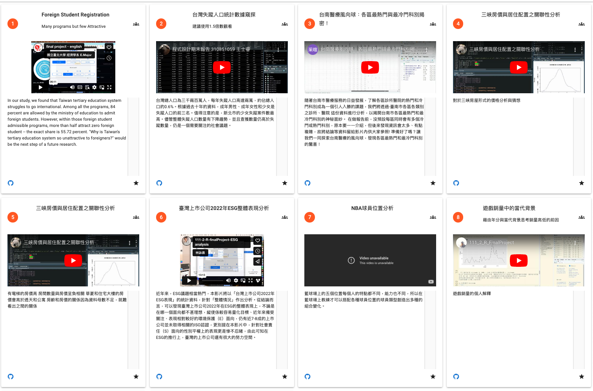

# MUI Grid

- [Grid v2](https://mui.com/material-ui/react-grid2/) is a new version of the grid system that is more flexible and easier to use.  

## How to

  - Use the `container` prop to create a grid container that wraps the grid items (the Grid is always an item).

  - Column widths are integer values between 1 and 12. They can be applied at any breakpoint to indicate how many columns are occupied by the component.

### example 1

  - `xs` means: for eXtreme Small screens (less than 600px wide) or larger, use this number of columns.
  
  - If the accumulated column width exceeds 12, the grid item will start from the next row.

```jsx
<Grid container spacing={2}>
  <Grid xs={8}> 
    <Item>xs=8 (row 1)</Item>
  </Grid>
  <Grid xs={4}>
    <Item>xs=4 (row 1)</Item>
  </Grid>
  <Grid xs={4}>
    <Item>xs=4 (row 2)</Item>
  </Grid>
  <Grid xs={8}>
    <Item>xs=8 (row 2) </Item>
  </Grid>
</Grid>
```

  - The `spacing` prop is used to add space between the grid items.

### No width for inner item

A grid item like `<Item>` in the example above has no width. You let its parent `<Grid>` to decide its width.

### breakpoints

[Default breakpoints](https://mui.com/material-ui/customization/breakpoints/#default-breakpoints)

Each breakpoint (a key) matches with a fixed screen width (a value):

xs, extra-small: 0px
sm, small: 600px
md, medium: 900px
lg, large: 1200px
xl, extra-large: 1536px
These values can be customized.

## Gallery example

[](https://tpemartin.github.io/r-gallery2/week13/)


