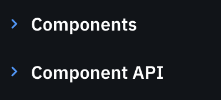

# Workspace in VScode 

Creating a New Workspace in VS Code  
1. Select the folders you would like in your Workspace.  
2. Add them to the Workspace by navigating to “File” then “Add Folder to Workspace.”   
3. With your workplace set up, save the new forum by going to “File” then “Save Workspace As.”  

# Project setup 

  * React+Vite project: `npm create vite@latest . -- --template react
  * Install dependencies: `npm install`
  
## MUI framework

  * [MUI](https://mui.com/material-ui/getting-started/)

[Core Installation](https://mui.com/material-ui/getting-started/installation/)

```bash
npm install @mui/material @emotion/react @emotion/styled
```

[Icon Installation](https://mui.com/material-ui/getting-started/installation/#icons)

```bash
npm install @mui/icons-material
```

# MUI



  * [Button](https://mui.com/components/buttons/)
  * [Card](https://mui.com/components/cards/)
  * [Grid](https://mui.com/components/grid/)
  * [Icon](https://mui.com/components/icons/)
  * [Typography](https://mui.com/components/typography/)


Based on the purpose/function of the UI, components in MUI core are divided into:

  * Inputs
  * Data display
  * Feedback
  * Surface
  * Navigation  
  * Layout
  * etc

Each category has more detailed design. You have to look for the one that is close to your needs.

# Box

  * [Box](https://mui.com/material-ui/react-box/)

```js
import * as React from 'react';
import Box from '@mui/material/Box';

export default function BoxSx() {
  return (
    <Box
      sx={{
        width: 300,
        height: 300,
        backgroundColor: 'primary.dark',
        '&:hover': {
          backgroundColor: 'primary.main',
          opacity: [0.9, 0.8, 0.7],
        },
      }}
    />
  );
}
```

Copy and paste it to


# Stacking

[Stacking](https://mui.com/material-ui/react-stack/)

# Typography

[Typography](https://mui.com/material-ui/react-typography/)

# Theme provider

[Theme Creator](https://zenoo.github.io/mui-theme-creator/)


