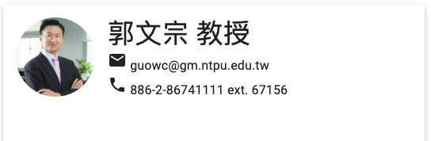

# OfficeInfo2

[](https://tpemartin.github.io/112-1-web-app-demo/week6/)

```jsx
<OfficeInformation
      imgLink="https://econ.ntpu.edu.tw/storage/images/ZlP7DHjLRh8IeahmFoT1EMxkmCgaxYtguN76FqiW.jpg"
      name = "郭文宗"
      title = "教授"
      officeHour="Thu. 12:00 - 14:00"
      email="guowc@gm.ntpu.edu.tw"
      phone="886-2-86741111 ext. 67156"
      office="社3F16"          
                />
```

## `<OfficeInformation>`

```jsx
function OfficeInformation({ imgLink, title, name, officeHour, email, phone, office }) {
    return (
        <>
        <Paper elevation={3} sx={{p: 2, maxWidth: "500px", height: "700px"}}>
            <OfficeInfoHeader imgLink={imgLink} name={name} title={title} email={email} phone={phone} />
        </Paper>
        </>
    )
}
```

  - [MUI paper](https://mui.com/components/paper/)

## `<OfficeInfoHeader>`


```jsx
function OfficeInfoHeader({ name, title, imgLink, email, phone }) {
    return (
        <Stack direction="row" spacing={2}>
            <Avatar alt={name} src={imgLink} sx={{ width: 100, height: 100 }} />
            <Name_Email_Phone name={name} title={title} email={email} phone={phone} />
        </Stack>
    )
}
```

  - [MUI avatar](https://mui.com/components/avatars/)

### `<Name_Email_Phone>`


```jsx
function Name_Email_Phone({ name, title, email, phone }) {
    return (
        <Stack direction="column" spacing={0}>
            <Typography variant="h4">
                {name} {title}
            </Typography>
            <Typography variant="body1">
                <EmailIcon /> {email}
            </Typography>
            <Typography variant="body1">
                <PhoneIcon /> {phone}
            </Typography>
        </Stack>
    )
}
```

  - [MUI icons](https://mui.com/components/material-icons/)

## `<OutOfOffice>`


```jsx
function OutOfOffice() {


    // const [open, setOpen] = React.useState(true);
    const open = true;

    return (
        <Backdrop
            sx={{ color: '#fff', zIndex: 2 }}
            open={open}
            onClick={() =>{}}>

            <Alert onClose={() => {}}>臨時有事，約3點回來</Alert>
        </Backdrop>

    )
}
```

  - [MUI Backdrop](https://mui.com/components/backdrop/)  
  - [MUI Alert](https://mui.com/components/alert/)
  - [CSS z-index](https://developer.mozilla.org/en-US/docs/Web/CSS/z-index)

We want

  - When user click on the backdrop or the x sign in alert, the backdrop disappears. On the other words, when the above action happens, `open` becomes `false`, and the returned component can be rendered again under the new setting.  

### Event handling

Event handler is a function of action:
```jsx
function(){
  // open becomes false
}
```

### State variable

In React, when state variable value changes, the component will be re-rendered. 

We need to make `open` a state variable, so that when it changes, the component will be re-rendered.


```jsx
import * as React from 'react';
import { Alert, Backdrop } from "@mui/material";


export default function OutOfOffice() {


    const [open, setOpen] = React.useState(true);
    
    return (
        <Backdrop
            sx={{ color: '#fff', zIndex: 2 }}
            open={open}
            onClick={() =>{
                setOpen(false)
            }}>

            <Alert onClose={() => {
                setOpen(false)
            }}>臨時有事，約3點回來</Alert>
        </Backdrop>

    )
}
```

  - [React useState](https://react.dev/reference/react/useState)


# Tab

  - [MUI Experimental Tab](https://mui.com/material-ui/react-tabs/#experimental-api)

```bash
npm install @mui/lab
```

module
```jsx
import * as React from 'react';
import Tab from '@mui/material/Tab';
import TabContext from '@mui/lab/TabContext';
import TabList from '@mui/lab/TabList';
import TabPanel from '@mui/lab/TabPanel';
import { Container } from '@mui/material';

export default function OfficeInfoTab({officeHour, classes}) {

  const [value, setValue] = React.useState('1');

  const handleChange = (event, newValue) => {
    alert("change")
    setValue(newValue);
  };

  tablist = <TabList 
          onChange={()=>{console.log(this)}} aria-label="lab API tabs example">
            <Tab label="課表" value="1" />
            <Tab label="Office Hours" value="2" />
          </TabList>
  return (
      <TabContext value={value}>
        <Container sx={{width: "300px"}}>
          {tablist}
        </Container>
        <TabPanel value="1">{officeHour}</TabPanel>
        <TabPanel value="2">{classes}</TabPanel>
      </TabContext>        
  );
}
```

  - `TabContent` component takes on property input `value`. This input values determines which tab is active.
  - Each tab has two components involved: `Tab` and `TabPanel`. `Tab` is the tab button, `TabPanel` is the content of the tab. Their are paired through the `value` property.


## `<Container>` vs `<Box>`

  - [MUI Container](https://mui.com/components/container/)

`<Box>` is for margin and padding needs, `<Container>` is for horizontal centering.

## State

When the UI appearance depends on something, that something is called **state**. In this case, the state is the `value` input of `TabContext`.

To get the button tag's value, we need to use `event.target.value` in the `onChange` function.