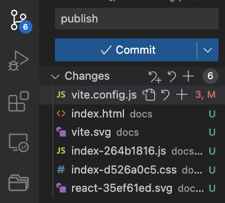

# Github page

## vite.config.js

vite.config.js

```js
import { defineConfig } from 'vite'
import react from '@vitejs/plugin-react'
import {resolve} from 'path'

const root = resolve(__dirname, 'src')
const outDir = resolve(__dirname, 'docs')
// https://vitejs.dev/config/
export default defineConfig({
  plugins: [react()],
  base: '/{your project folder name}/',
  build: {
    outDir,
    emptyOutDir: true
}})
```

## Publish to Github


## Set up github page

In web app repo github website, 

Settings -> Pages -> 


## Build and push to github

```bash
npm run build
```

Then 




# Multiple page web app


[112-1-web-app-demo](https://github.com/tpemartin/112-1-web-app-demo)

## [vite.config.js](https://github.com/tpemartin/112-1-web-app-demo/blob/main/vite.config.js) setup

## individual page setup

Each page should be inside its own folder and with the structure as [here](https://github.com/tpemartin/112-1-web-app-demo/tree/main/src/main)


 